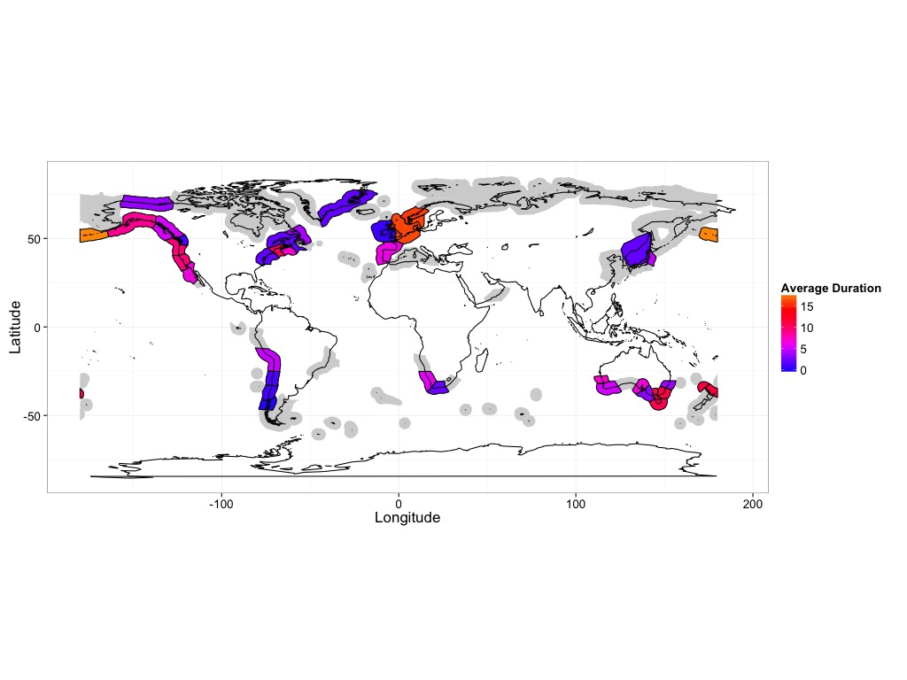
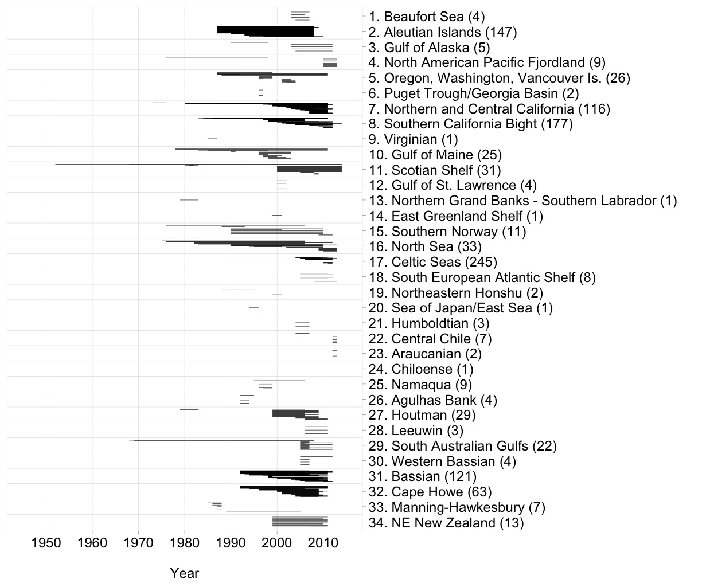

# Data Summaries of Derived Cleaned Data from

 Krumhansl, K.A., Okamoto, D.K., Rassweiler, A., Novak, M., Bolton, J.J., Cavanaugh, K.C., Connell, S.D., Johnson, C.R., Ling, S.D., Micheli, F., Norderhaug, K.M., Pérez-Matus, A., Sousa-Pinto, I., Reed, D.C., Salomon, A.K., Shears, N.T., Wernberg, T., Anderson, R.J., Barrett, N.S., Buschmann, A.H., Carr, M.H., Caselle, J.E., Derienne, S., Edgar, G.J., Edwards, M., Estes, J.A., Goodwin, C., Kenner, M.C., Kushner, D.J., Moy, F.E., Nunn, J., Steneck, R., Vasquez, J.A., Watson, J., Witman, J.D., Byrnes, J., In Press. **Global patterns of kelp forest change over the past half-century**. *PNAS*.

Scripts in this folder do two things

##### 1. Data filtering and preparation for analysis: `0_temporal_kelp_prep.R`

This script takes the cleaned data and applies different filtering schemas to it - filtering by sample size, number of years sampled, and others to generate data sets ready for analysis. In Krumhansl et al. we limited ourselves to datasets with three or more data points. Results are robust to other filtering schemas.

This script should be run before any analysis and the proper filtering applied.

##### 2. Generating figures summarizing the data set

`1_samplesizeMap_durationplot.R` uses http://github.com/jebyrnes/meowR to generate maps of the sample size and duration of the data using different geospatial aggregations from the Marine Ecoregions of the World by Spalding et al. 2007.

For example

`2_data_timespans.R` creates plots of the time periods covered by each individual site in each study. These plots are split by region to help the reader visualize what was sampled where and when.

