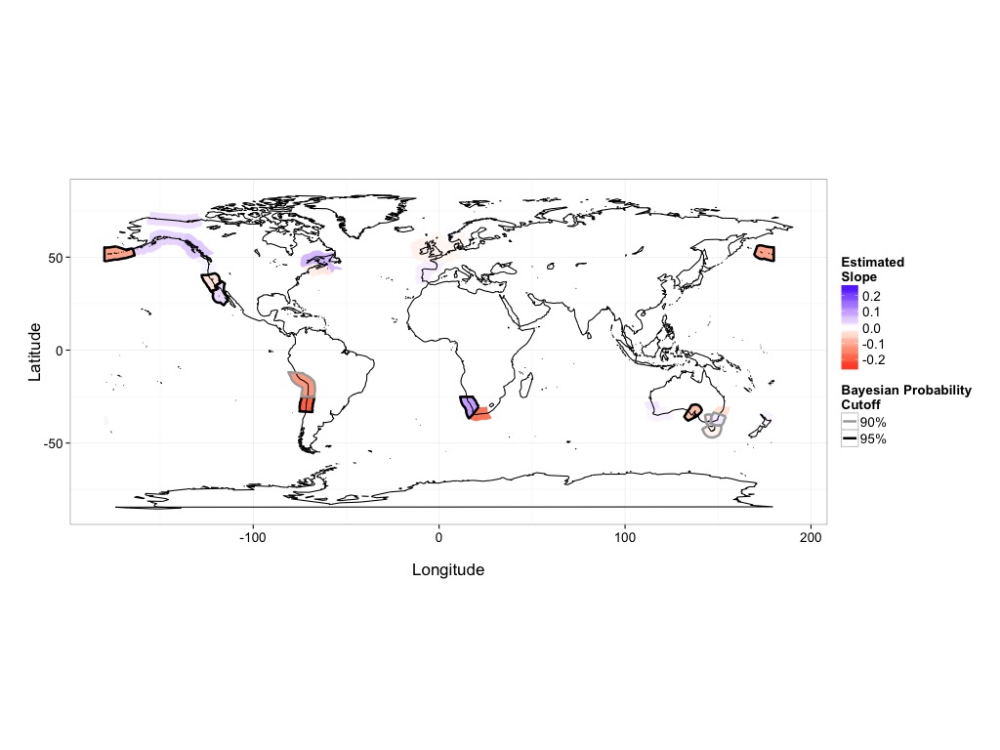

# Global Kelp Time-Series Analyses Code and Data

From Krumhansl, K.A., Okamoto, D.K., Rassweiler, A., Novak, M., Bolton, J.J., Cavanaugh, K.C., Connell, S.D., Johnson, C.R., Ling, S.D., Micheli, F., Norderhaug, K.M., Pérez-Matus, A., Sousa-Pinto, I., Reed, D.C., Salomon, A.K., Shears, N.T., Wernberg, T., Anderson, R.J., Barrett, N.S., Buschmann, A.H., Carr, M.H., Caselle, J.E., Derienne, S., Edgar, G.J., Edwards, M., Estes, J.A., Goodwin, C., Kenner, M.C., Kushner, D.J., Moy, F.E., Nunn, J., Steneck, R., Vasquez, J.A., Watson, J., Witman, J.D., Byrnes, J., In Press. **Global patterns of kelp forest change over the past half-century**. *PNAS*.

This repository contains all of the clean data and code used to generate the analyses and figures from Krumhansl et al. We will be updating the data periodically after publication in an attempt to keep the results current. There are also more analyses here than present in the paper for those interested in exploring our results further.

## How to replicate our analyses
Broadly this repository is split into ordered directories, each containing a set of steps crucial to our data analysis and figure generating pipeline. We will include readme files in each directory to help you replicate our analyses exactly and understand what is going on.

All steps, save the data cleaning done in SAS, were run in R. Provided you are not re-cleaning the data, you'll need R installed with the dplyr, ggplot2, rstan, and several other libraries used opportunistically throughout the code as indicated. For ecoregions, you'll need to install the meowR library from co-author Jarrett Byrnes -  http://github.com/jebyrnes/meowR

# 1) Data
The first of these, `01_clean_raw_data`, is a set of clean raw data from the authors of the paper and mined from the literature. By agreement with data providers, we cannot provide the original data sets, although cleaning code (which is a whole repository in and of itself) is available upon request, and we are happy to refer you to the relevant authors for original data. Many of the datasets used include far more than just kelp data, and thus might be relevant for other explorations.

As the data files can be quite large, we have compressed the data directory down to [01_clean_raw_data.zip](01_clean_raw_data.zip) which you should expand upon downloading or forking the repository.

# 2) Data cleaning

The folder `02_sas_and_r_data_derivation_scripts` includes multiple files for combining and modifying the cleaned data files. The two SAS files in that directory will reprocess the data and assemble it into a single file places in `03_derived_data` for later analysis. Accompanying scripts reprocess taxonomic information about individual data sets and the final file, `addRegionalData.R` adds Spalding et al'.s Marine Ecoregions of the world classifications to the clean data file.

See readme in the derived data folder for metadata.

# 3) Summary information about dataset

The folder`04_derived_data_analysis`contains three files that work with the derived data. The first, `0_temporal_kelp_prep.R`, contains methods for filtering the data according to criteria of number of years or number of data points. Used as a preprocessing step for all other analyses, with all using the three point per study criteria.

Other scripts plot the distribution of sampling effort and information about the timespans of sampling.

# 4) Hierarchical Linear Model Analyais

The folder `05_HLM_analysis_code` contains all code and data it derives to run our main linear model analysis using `rstan`. Note, moedl runs take some time, so plan accordingly. Resulting coefficients and other output are placed into `06_HLM_output`.

# 5) Visualization and analysis of HLM results

Last, the folder `07_analysis_of_HLM_results` contains code to visualize the results of the HLM. See readme for details.
